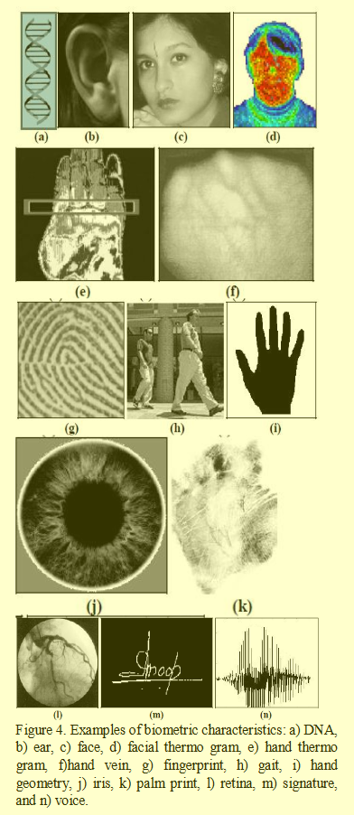

# Biometrics and Adversarial Biometrics

Biometric includes but not limits in following characters:

## Biometrics and Algorithm

### Fingerprint Identification 

[Introduction to Fingerprint Identification](http://www.pslc.ws/macrog/kidsmac/firehouse/arson/fbiprint.htm)

`Fingerprint Recognition in Android`, more detailed information need to check source code

Potential Process:
- collect fingerprint
- enhance image of fingerprint
- match with database(different algorithms)

[Fingerprint Image Enhancement: Algorithm and Performance Evaluation](https://www.researchgate.net/publication/3192878), Lin Hong, et al, 1998

We present a fast fingerprint enhancement algorithm, which can adaptively improve the clarity of ridge and valley structures of input fingerprint images based on the estimated local ridge orientation and frequency.  

[Finger Print Matching Algorithm for Android](https://www.ijert.org/download/6068/finger-print-matching-algorithm-for-android), K. Rathi and S. Sawarkar, 2013

### Face Identification 

None

### Behavioral Biometric

#### Keystroke Dynamic

[Comparing Anomaly-Detection Algorithms for Keystroke Dynamics](https://www.cs.cmu.edu/~maxion/pubs/KillourhyMaxion09.pdf), K. Killourhy and R. Maxion, 2009

In this paper, the author published the results of different classification algorithms, along with the benchmark DSN dataset.

[Keystroke Biometrics Ongoing Competition](https://www.idiap.ch/~aanjos/papers/ieee-access-2016.pdf), A. Morales, et al, 2016

The current state of the art for the classifiers is represented by the Keystrokes Biometrices Ongoing Competition (KBOC)

[Robust Keystroke Biometric Anomaly Detection](https://arxiv.org/pdf/1606.09075.pdf), J. V. Monaco, 2016

[Code for submissions to the Keystroke Biometrics Ongoing Competition](https://github.com/vmonaco/kboc), J. V. Monaco, 2017 

Winner of the competition and his code

#### Touchscreen Swipe

[Biometric Authentication Based on Touchscreen Swipe Patterns](https://www.sciencedirect.com/science/article/pii/S2212017316000621), M. Antal and L. Z. Szabo, 2016

Antal et al. recently published a comprehensive analysis of many classifiers, along with a standard dataset that had features extracted from swipes on an Android platform.

## Adversarial Biometrics

[Enhancing security and privacy in biometrics-based authentication systems](https://www.researchgate.net/profile/Jonathan_Connell/publication/220353130_Enhancing_Security_and_Privacy_in_Biometrics-Based_Authentication_Systems/links/555a010508ae6fd2d8281b10/Enhancing-Security-and-Privacy-in-Biometrics-Based-Authentication-Systems.pdf), N. K. Ratha, et al, 2001

### Behavioral Biometric

#### Keystroke Dynamic

[K-means++ vs. Behavioral Biometrics: One Loop to Rule Them All](http://wp.internetsociety.org/ndss/wp-content/uploads/sites/25/2018/02/ndss2018_03B-2_Negi_paper.pdf), Parimarjan Negi, et al, 2018

With Targeted K-means++ we could compromise the security of 40-70% of users within ten tries. In contrast, with Indiscriminate  K-mean++, the security of 30-50% of users was compromised. 

### Speech Biometric

[Attacks on Speech Biometric Authentication](http://citeseerx.ist.psu.edu/viewdoc/download?rep=rep1&type=pdf&doi=10.1.1.217.9184), K. Inthavisas and D. Lopresti, 2011
