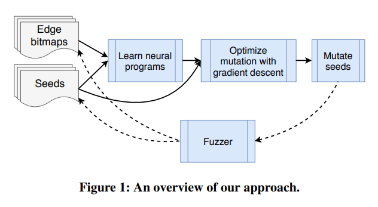

# Fuzzing

## 1. AFL-based Fuzzing

- [AFL Fuzzer Offical Site](http://lcamtuf.coredump.cx/afl/)
- [AFL Fuzzer Github](https://github.com/mirrorer/afl)

> American Fuzzy Lop is a brute-force fuzzer coupled with an exceedingly simple but rock-solid instrumentation-guided genetic algorithm. It uses a modified form of edge coverage to effortlessly pick up subtle, local-scale changes to program control flow.

- [Project Triforce: Run AFL on Everything!](https://www.nccgroup.trust/us/about-us/newsroom-and-events/blog/2016/june/project-triforce-run-afl-on-everything/)
- [AFL/QEMU fuzzing with full-system emulation](https://github.com/nccgroup/TriforceAFL)

> This is a patched version of AFL that supports full-system fuzzing using QEMU. The included QEMU has been updated to allow tracing of branches when running a system emulator for x86_64. Extra instructions have been added to start AFL's forkserver, make fuzz settings, and mark the start and stop of test cases.

- [Coverage-based Greybox Fuzzing as Markov Chain](https://www.comp.nus.edu.sg/~mboehme/paper/CCS16.pdf)
- [AFLFast Github](https://github.com/mboehme/aflfast)

> In 24 hours, AFLFast exposes 3 previously unreported CVEs that are not exposed by AFL and exposes 6 previously unreported CVEs 7x faster than AFL. AFLFast produces at least an order of magnitude more unique crashes than AFL.

- [PTFuzzer, using Intel PT to collect branch information](https://github.com/hunter-ht-2018/ptfuzzer)

> 1. Binary-only fuzzing. We propose a new greybox fuzzer to fuzz any binaryonly softwares and do not need any source code. In situations where source code is unavailable, compile-time instrumentation and thorough program analysis is impossible, and fuzzers like AFL, AFLFast and VUzzer will be of no use. Our approach can gracefully handle these situations and fuzz binaries as usual.
> 2. Fast feedback mechanism. We introduce a much faster feedback mechanism. As mentioned above, though previous works tried hard to solve the problem of source code reliance, they all suffer from considerable performance overhead, especially QAFL and TriforceAFL. We utilize fast hardware feedback directly from CPU, and deal with binary-only fuzzing in a faster way than QAFL. The performance overhead of our fuzzer is smaller than QAFL according to our experiments.
> 3. Accurate coverage feedback. We propose a more accurate measurement for code coverage feedback. Compile-time instrumentation and random id assignment of basic blocks will measure code coverage inaccurately. We use actual run-time addresses of basic blocks to trace transitions between basic blocks and can provide real control flow information of running code.
> 4. PTfuzzer. We implement a prototype called PTfuzzer based on these insights. And our experiments show that PTfuzzer can deal with binary-only fuzzing quickly and accurately.

- [afl-cov - AFL Fuzzing Code Coverage](https://github.com/mrash/afl-cov)

> afl-cov uses test case files produced by the AFL fuzzer afl-fuzz to generate gcov code coverage results for a targeted binary. Code coverage is interpreted from one case to the next by afl-cov in order to determine which new functions and lines are hit by AFL with each new test case. Further, afl-cov allows for specific lines or functions to be searched for within coverage results, and when a match is found the corresponding test case file is displayed. This allows the user to discover which AFL test case is the first to exercise a particular function. In addition, afl-cov produces a "zero coverage" report of functions and lines that were never executed during any AFL fuzzing run.

## 2. Grammar-based Fuzzing

- [Grammar-based Whitebox Fuzzing](http://moflow.org/ref/Grammar-based%20Whitebox%20Fuzzing.pdf)

### 2.1 Browser Fuzzing

- [Vulnerability Discovery Against Apple Safari: Evaluating Complex Software Targets for Exploitable Vulnerabilities](http://blog.ret2.io/2018/06/13/pwn2own-2018-vulnerability-discovery/)
- [Smashing	The	Browser: From Vulnerability Discovery To Exploit](https://hitcon.org/2014/downloads/P1_06_Chen%20Zhang%20-%20Smashing%20The%20Browser%20-%20From%20Vulnerability%20Discovery%20To%20Exploit.pdf)

#### 2.1.1 DOM Fuzzing

- [Domato: Google DOM Fuzzer](https://github.com/google/domato)
- [Code Coverage Explorer for IDA Pro](https://github.com/gaasedelen/lighthouse)
- [State Fuzzer](https://github.com/demi6od/ChromeFuzzer)

#### 2.1.2 JS Engine Fuzzing

- [JavaScript Fuzzing in Mozilla](https://nth10sd.github.io/js-fuzzing-in-mozilla/?full#cover)
- [dharma: A generation-based, context-free grammar fuzzer](https://github.com/MozillaSecurity/dharma)
- [funfuzz: JavaScript engine fuzzers](https://github.com/MozillaSecurity/funfuzz)

## 3. Machine Learning based Fuzzing

- [NEUZZ: Efficient Fuzzing with Neural Program Learning](https://arxiv.org/abs/1807.05620)

> Fuzzing has become the de facto standard technique for finding software vulnerabilities. However, even the state-of-the-art fuzzers are not very efficient at finding hard-to-trigger software bugs. Coverage-guided evolutionary fuzzers, while fast and scalable, often get stuck at fruitless sequences of random mutations. By contrast, more systematic techniques like symbolic and concolic execution incur significant performance overhead and struggle to scale to larger programs. 
> We design, implement, and evaluate NEUZZ, an efficient fuzzer that guides the fuzzing input generation process using deep neural networks. NEUZZ efficiently learns a differentiable neural approximation of the target program logic. The differentiability of the surrogate neural program, unlike the original target program, allows us to use efficient optimization techniques like gradient descent to identify promising mutations that are more likely to trigger hard-to-reach code in the target program. 
> We evaluate NEUZZ on 10 popular real-world programs and demonstrate that NEUZZ consistently outperforms AFL, a state-of-the-art evolutionary fuzzer, both at finding new bugs and achieving higher edge coverage. In total, NEUZZ found 36 previously unknown bugs that AFL failed to find and achieved, on average, 70 more edge coverage than AFL. Our results also demonstrate that NEUZZ can achieve average 9 more edge coverage while taking 16 less training time than other learning-enabled fuzzers.

> 

> NEUZZ has two main steps: 
> - (1) Training an NN to learn the logic of the program under test.
> - (2) Computing gradient of the model to locate the critical bytes in input and mutate them based on the gradient value.
